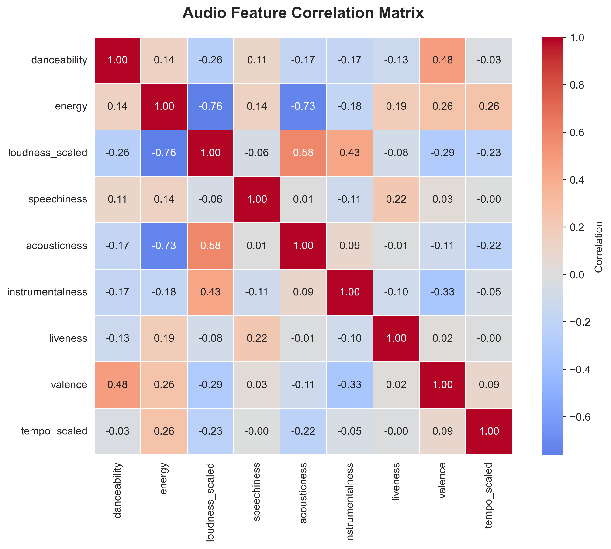
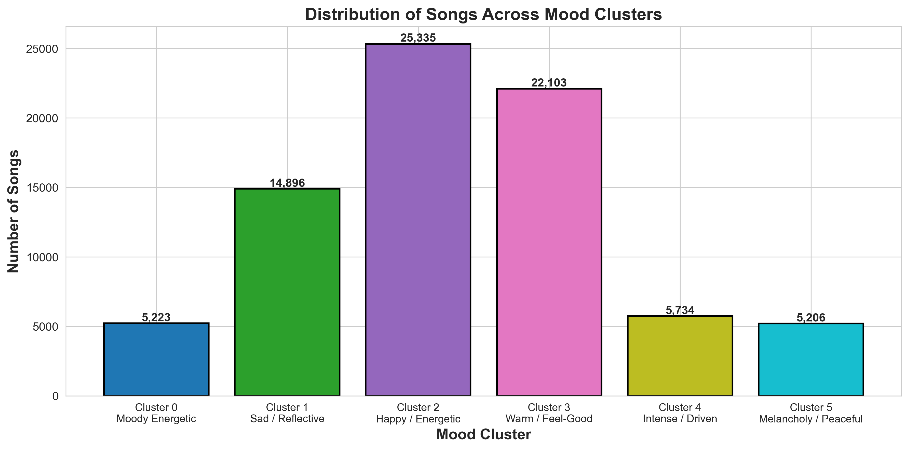
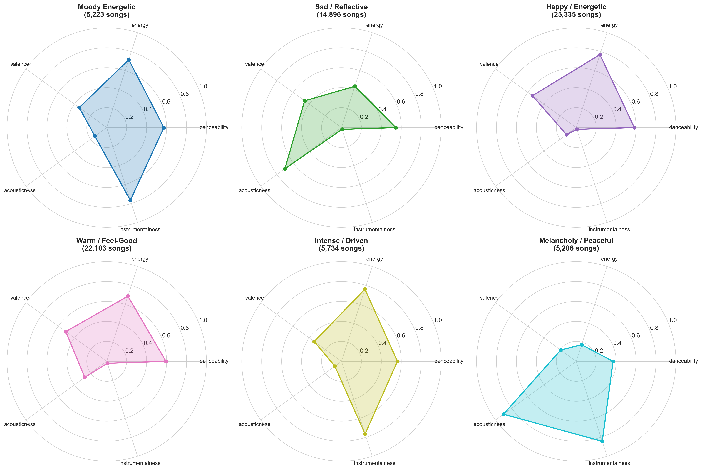
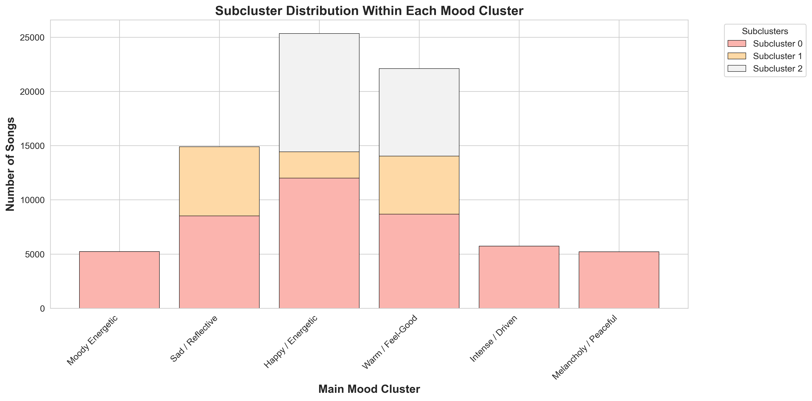
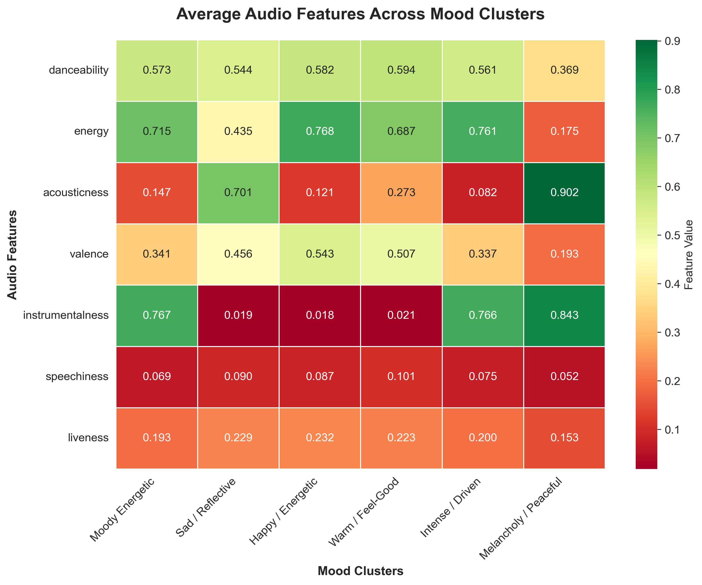

#  Spotify Mood-Based Music Recommender

> **A two-level K-Means clustering engine that recommends songs based on audio-feature similarity and emotional context — built on 114 K Spotify tracks and shipped as an interactive Gradio app.**


---

##  Overview

Traditional streaming recommenders lean heavily on **artist similarity** and **popularity**. They ignore the *underlying acoustic profile* of a song (energy, valence, tempo, acousticness) and the listener's **current mood**.

This project takes the opposite approach: it clusters 114 K Spotify tracks into mood archetypes using their audio features, then recommends songs that match both the user's personal listening history **and** a chosen mood — using cosine similarity over an audio-feature profile.

The final deliverable is an interactive Gradio app where a user uploads their Spotify library, picks a mood, and gets a balanced, personalized playlist.

---

##  Problem & Business Context

| | |
|---|---|
| **Problem** | Mood-based discovery is underserved. Listeners don't only want "more like X" — they want "something happy for the commute" or "something melancholy for the rain." |
| **Why it matters** | Better mood discovery → longer sessions, higher engagement, better playlist conversion — the metrics streaming platforms actually optimize. |
| **What this builds** | A reproducible, audio-feature-first recommender that complements collaborative-filtering systems rather than competing with them. |

---

##  What the System Does

1. **Ingests** a user's personal Spotify library (JSON export).
2. **Matches** the user's songs against a 114 K-track global catalog.
3. **Inherits** mood-cluster labels for each matched song.
4. **Asks** the user to pick a target mood and a playlist size.
5. **Builds** an average audio-feature *profile* of the user inside that mood.
6. **Ranks** candidate tracks by cosine similarity to that profile.
7. **Returns** a balanced playlist, respecting subcluster proportions to keep musical variety.



*Interactive workflow diagram in [docs/workflow_diagram.md](docs/workflow_diagram.md) (Mermaid).*

---

##  Dataset

| Property | Value |
|---|---|
| **Source** | Spotify track-level audio features (114 000 tracks) |
| **Features used** | danceability, energy, valence, acousticness, instrumentalness, liveness, speechiness, tempo, loudness, key, mode, time_signature, explicit, duration |
| **After cleaning** | ~82 000 unique tracks |
| **Removed** | 32 000 duplicates (same name + primary artist), 3 metadata nulls, tracks <90 s or >15 min, invalid loudness |

---

##  Methodology

### Feature Engineering
- Composite `artists` string split into `artist_1`, `artist_2`, `artist_3`
- Min-max scaling on tempo
- Inverted min-max on loudness (so higher = louder)
- Binary encoding on explicit content
- Genre one-hots aggregated into broad families before scaling

### Why K-Means

I tested K-Means against Hierarchical Clustering and DBSCAN. K-Means won on four dimensions:

| Criterion | K-Means | Hierarchical | DBSCAN |
|---|---|---|---|
| **Speed @ 114K rows** | ✅ ~600× faster than hierarchical | ❌ O(n²) memory | ⚠️ Slow at scale |
| **Predicts new songs** | ✅ Yes — `predict()` on new vectors | ❌ Must re-cluster | ❌ No native predict |
| **Geometric fit** | ✅ Spherical, matches audio feature space | ⚠️ Mixed | ⚠️ Sparse audio regions hurt density-based methods |
| **Two-level architecture** | ✅ Easy to nest | ⚠️ Heavy | ❌ Not native |

### Two-Level Clustering Architecture

```
Level 1 → 6 mood clusters (K=6 chosen via elbow + silhouette)
Level 2 → 2 subclusters per mood (12 micro-mood segments total)
```

Hyperparameters: `KMeans(n_clusters=6, random_state=42, n_init=200, max_iter=600)`.

### Cluster Identities (interpreted post-hoc)

| Cluster | Mood | Vibe |
|:-:|---|---|
| 0 | Moody Energetic | Driving, edgy, mid-valence |
| 1 | Sad / Reflective | Low valence, low energy, acoustic-leaning |
| 2 | Happy / Energetic | High valence, high energy, danceable |
| 3 | Warm / Feel-Good | High valence, mid energy, soulful |
| 4 | Intense / Driven | High energy, low valence, percussive |
| 5 | Melancholy / Peaceful Sad | Low energy, mid valence, ambient |

### Recommendation Logic

Inside the chosen mood:
1. Compute the user's **mean audio-feature vector** across their matched songs.
2. Compute **subcluster distribution** (e.g. 73 % subcluster-0, 27 % subcluster-1).
3. Pull candidates from those subclusters **excluding songs the user already owns**.
4. Rank candidates by **cosine similarity** to the user profile.
5. Allocate the playlist proportionally across subclusters → keeps musical variety even within one mood.

---

##  Key Visualizations

### Audio-feature correlation heatmap


### Cluster distribution


### Mood-cluster profiles (radar)


### Subcluster breakdown


### Feature heatmap by cluster


---

##  Tech Stack

| Layer | Tools |
|---|---|
| **Data** | `pandas`, `numpy` |
| **Modeling** | `scikit-learn` (KMeans, cosine_similarity, StandardScaler) |
| **Viz** | `matplotlib`, `seaborn`, Mermaid |
| **App** | `gradio` (interactive playlist generator) |
| **Notebooks** | Jupyter |

---

##  Repository Structure

```
spotify-mood-recommender/
├── notebooks/
│   ├── spotify_data_cleaning.ipynb       # EDA + cleaning of the 114K catalog
│   └── double_clustering_model.ipynb     # Two-level clustering + recommender + Gradio app
├── assets/
│   ├── cluster_distribution.png
│   ├── feature_correlation.png
│   ├── feature_heatmap.png
│   ├── mood_profiles_radar.png
│   └── subcluster_breakdown.png
├── docs/
│   ├── workflow_diagram.md               # Mermaid flow diagram
│   └── Presentation.pptx                 # Full project deck
├── requirements.txt
├── LICENSE
└── README.md
```

---

##  Run It Locally

```bash
git clone https://github.com/ferozobaid/spotify-mood-recommender.git
cd spotify-mood-recommender
python -m venv .venv && source .venv/bin/activate
pip install -r requirements.txt
jupyter lab notebooks/double_clustering_model.ipynb
```

The final cell launches the Gradio app — open the local URL it prints and upload your Spotify library JSON to generate a mood-based playlist.

---

## 🔭 Future Improvements

- **Lyric embeddings** — fuse audio features with sentence-transformer embeddings of lyrics for finer-grained mood
- **Cold-start API** — let users skip the library upload and seed with 3–5 favorite tracks
- **Diversity reranking** — MMR (Maximal Marginal Relevance) layer on top of cosine ranking
- **Online evaluation** — A/B against a collaborative-filtering baseline on a held-out user cohort
- **Spotify Web API integration** — pull user library live instead of JSON upload

---

##  Collaboration & Attribution

This project was completed as a collaborative academic / portfolio project together with **[Matthieu Lafont](https://github.com/Mlaf27)** during the McGill Master of Management Analytics program.

This repository is **my independently published version** of that work — including my own implementation contributions, analysis, documentation, and presentation. Matthieu maintains his own version at [Mlaf27/Spotify-Recommendation-Model](https://github.com/Mlaf27/Spotify-Recommendation-Model).

---

##  Author

**Feroz Obaid Khan** — Master of Management Analytics, McGill University
🔗 GitHub: [@ferozobaid](https://github.com/ferozobaid)

## 📜 License

MIT — see [LICENSE](LICENSE).
